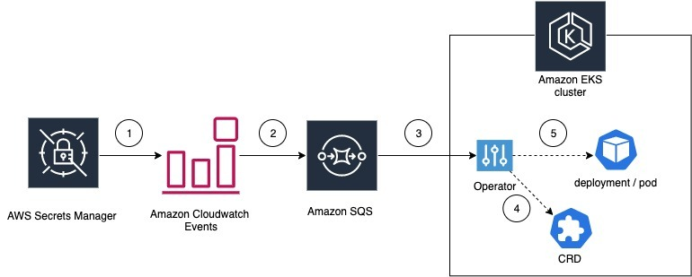

# Introduction
This project helps users to automatically redeploy the pods running on Amazon EKS cluster when the secrets in AWS Secerets Manager is rotated. When the pods are restarted, webhook in our previous [blog](https://aws.amazon.com/blogs/containers/aws-secrets-controller-poc/) will retrive the latest secret and mount it onto the pods.



## Install the CRD and Operator
1. kubectl should be configured to acces EKS cluster on the system where you build the project - https://docs.aws.amazon.com/eks/latest/userguide/install-kubectl.html

2. Install kubebuilder - https://book.kubebuilder.io/quick-start.html#installation

3. Clone the project into go project path -   
```
git clone https://github.com/Mahendrasiddappa/secretoperator.git && cd secretoperator
```

4. To test the operator we need a SQS queue and AWS EventBridge rule, which will store the event details of the PutSecretValue API call, so that the Secrets controller can get the secret rotation details. You can either use existing resources or create resources by run the below command -
```
make aws
```
Running the above command will create a CloudFormation stack provisining following resources -
```
* sample secret
* EventBridge rule
* IAM role for operator IRSA
* SQS queue
```

5. Following commands will get region, SQS URL and IRSA IAM role arn from the CloudFormation stack created in step 3. If you want to use existing resources in your account you can pass those vaules to the below variables - 
* ```export OPERATOR_REGION=$(aws cloudformation describe-stacks --stack-name EKS-Secrets-Operator-Stack --query "Stacks[0].Outputs[?OutputKey=='Region'].OutputValue" --output text)```
* ```export SQS_URL=$(aws cloudformation describe-stacks --stack-name EKS-Secrets-Operator-Stack --query "Stacks[0].Outputs[?OutputKey=='QueueURL'].OutputValue" --output text)```
* ```export IAM_ARN=$(aws cloudformation describe-stacks --stack-name EKS-Secrets-Operator-Stack --query "Stacks[0].Outputs[?OutputKey=='IAMRole'].OutputValue" --output text)```

6. Replace those values in the controller deployment configuration - 
* ```sed -i "s,SQS_URL,${SQS_URL},g" config/manager/manager.yaml```
* ```sed -i "s,OPERATOR_REGION,${OPERATOR_REGION},g" config/manager/manager.yaml```
* ```sed -i "s,IAM_ARN,${IAM_ARN},g" config/manager/manager.yaml```

7. Install CRD -   
```
make install
```

7. Build and push the controller image to your repository -   
```
make docker-build docker-push IMG=<registry>:<tag>
```

8. deploy the controller on the cluster 
```
make deploy IMG=<registry>:<tag>
```


## Testing 
1. Create CRD in default namespace which will look for Deployments, Daemonsets and Statefulset's with labesl "environment: OperatorTest" -
  ```
  kubectl create -f config/samples/awssecretsoperator_v1_secretsrotationmapping.yaml
  ```

2. Create a deployment which runs nginx pods and has labels "environment: operatortest" - 
  ```
  kubectl create -f config/samples/deployment.yaml
  ```

3. Create PutSecretValue event -
```
aws secretsmanager put-secret-value --secret-id eks-controller-test-secret --secret-string [{testsqssec:newsecret}]
```

## Result - 
The secrets-nginx deployment should restart the pods

## Troubleshooting -
1. How to check if the secretoperator is running
Check if there is deployment called "secretoperator-controller-manager" namespace "secretoperator-system". And make sure the pod in the deployment is ready.

2. How to check the logs 
kubectl logs -c manager -l control-plane=controller-manager -n secretoperator-system

3. How to fix the issue if secretoperator pod logs are showing Access Denied errors ?
i. Make sure the OperatorRole created by CloudFormation stack in step 4 has the correct trust policy according to IRSA guidlines [A]
ii. Make sure the OIDC ID in the trust policy is for the EKS cluster on which the operator is running
iii. Make sure the OIDC identity provider is created as per the IRSA guidlines [A]

4. What to check if the pods in Deployements/Daemonsets/Statefulset are not getting restarted after secret is updated ?
i. Check the CRD resource and make sure the secret you are updating the secret ID in the resource is same -
kubectl get SecretsRotationMapping secretsrotationmapping-sample -o yaml
ii. Make sure the label in the CRD resource and label in the Deployements/Daemonsets/Statefulset mathc. Labels are case sensitive.

A. https://aws.amazon.com/blogs/opensource/introducing-fine-grained-iam-roles-service-accounts/
